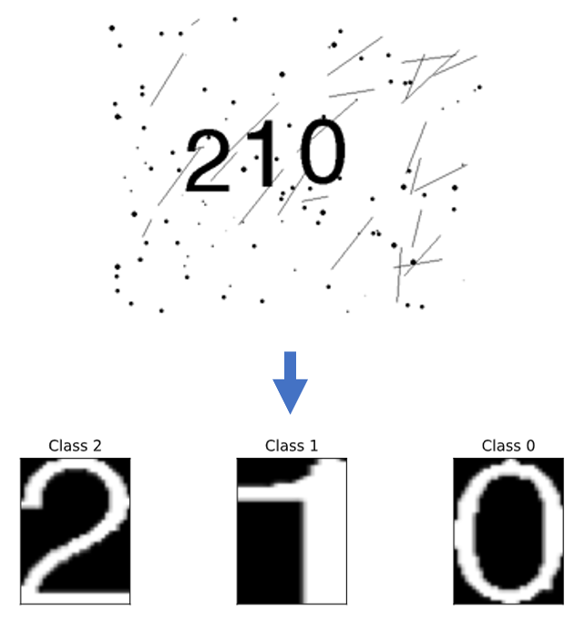

## [Classifying CAPTHA images - with and without a neural network](https://github.com/OlleKahreZall/Image-classification)

In this project, I have classified numbers which appear in images with two different classifiers: partly an algorithm I built myself and, partly a custom deisgned shallow convolutional neural network (CNN).

The data used are simplified CAPTCHA (Completely Automated Public Turing test to tell Computers and Humans Apart) images, which you probably have seen on websites where you have to prove that you are not a robot, where the task is to classify the numbers 0, 1 and 2 in each image. In total, 1200 images are used.

The accuracy of my own algorithm on the data is 99.7% and with the CNN, the accuracy score on the training and validation iamges is 99.95% and 100%, respectively. The former is, though, faster than the latter; it took 1.2 seconds for my algorithm to finish and 7.4 seconds for the CNN. My algorithm may be a little bit faster, but I would argue that the CNN is more suitable if new images are given to both classifiers.

## [Web scraping project - extracting data from the top 100 biggest cryptocurrencies](https://github.com/OlleKahreZall/Web-scraping-project)

* In this project, I have scraped the 100 biggest cryptocurrencies based on their market cap from [coinmarketcap.com](https://coinmarketcap.com/). 
* The web-crawling framework Scrapy was used. In addition, the portable framework Selenium was used since the web pages were dynamic.
* Information such as the daily volume, market cap, highest/lowest value for each cryptocurrency have been extracted. 
* This spider has fetched each cryptocurrency's data from its first day were documented on the cryptocurrency market (according to [coinmarketcap.com](https://coinmarketcap.com/)) to the 2nd of December. 
* In total, more than 800 000 data points have been extracted.

The web pages are scraped by using the script [cryptoscraper](https://github.com/OlleKahreZall/Web-scraping-project/blob/main/cryptoscraper.py) (see the file for more details). All the data collected from the web pages were stored in the csv file [cryptocurrencies_top-100.csv](https://github.com/OlleKahreZall/Web-scraping-project/blob/main/cryptocurrencies_top-100.csv).

Furthermore, the ipynb file [data-cleaning_visualization.ipynb](https://github.com/OlleKahreZall/Web-scraping-project/blob/main/data-cleaning_visualization.ipynb) was used to pre-process the data. It was also used to visualize the currently top 3 rated cryptocurrencies and their historical data. The figures below are generated by this script, which show the value (when the market closes), volume and the market cap for the respective cryptocurrency. 

