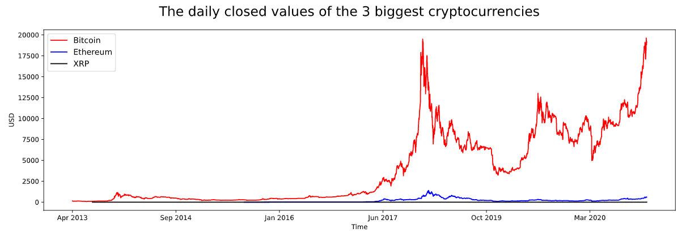
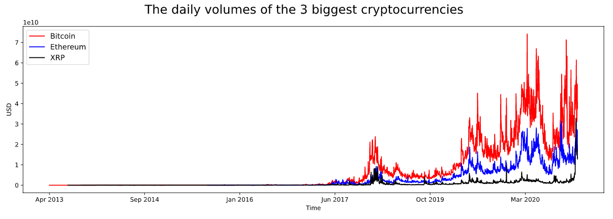
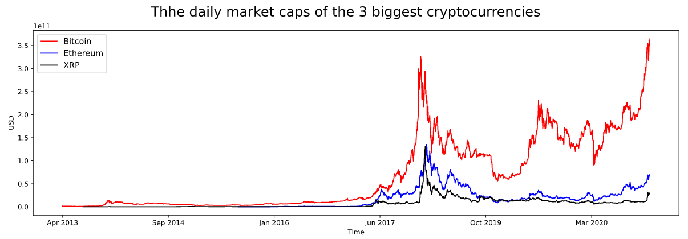

## [Classifying CAPTHA images - with and without a convolutional neural network](https://github.com/OlleKahreZall/Image-classification)

  

In this project, the goal was to classify the numbers 0, 1 and 2 in CAPTCHA (Completely Automated Public Turing test to tell Computers and Humans Apart) images. In total, the dataset consists of 1200 images and the dataset itself was given in an image analysis course at Uppsala University. I solved this task with two different classifiers: partly with an algorithm I built myself and, partly with a custom designed shallow convolutional neural network (CNN) using the library Keras.

The accuracy performance of my algorithm is 99.7% and with the CNN, the accuracy score on the training and validation images is 99.95% and 100%, respectively. The former is, though, faster than the latter; it took 1.2 seconds for my algorithm to finish and 7.4 seconds for the CNN. My algorithm may be a little bit faster, but the CNN, however, is a more generalizable model than my algorithm and a better classifier because of this. In addition, constructing the algorithm took much longer than designing the CNN...

The machine won again!

## [Web scraping project - extracting data from the top 100 biggest cryptocurrencies](https://github.com/OlleKahreZall/Web-scraping-project)

* In this project, I have scraped the 100 biggest cryptocurrencies based on their market cap from [coinmarketcap.com](https://coinmarketcap.com/). 
* The web-crawling framework Scrapy was used. In addition, the portable framework Selenium was used since the web pages were dynamic.
* Information such as the daily volume, market cap, highest/lowest value for each cryptocurrency have been extracted. 
* This spider has fetched each cryptocurrency's data from its first day were documented on the cryptocurrency market (according to [coinmarketcap.com](https://coinmarketcap.com/)) to the 2nd of December. 
* In total, more than 800 000 data points have been extracted.

The web pages are scraped by using the script [cryptoscraper](https://github.com/OlleKahreZall/Web-scraping-project/blob/main/cryptoscraper.py) (see the file for more details). All the data collected from the web pages were stored in the csv file [cryptocurrencies_top-100.csv](https://github.com/OlleKahreZall/Web-scraping-project/blob/main/cryptocurrencies_top-100.csv).

Furthermore, preprocessing of the data is done in the ipynb file [data-cleaning_visualization.ipynb](https://github.com/OlleKahreZall/Web-scraping-project/blob/main/data-cleaning_visualization.ipynb). In addition, this script is also used to visualize the historical data of the three largest cryptocurrencies with respect to their market cap (December 2020). The figures below show the value (when the market closes), volume and the market cap for each cryptocurrency. 

## Upcoming project - generating music with a recurrent neural network

Since I am quite interested in both music and machine learning, why not combine these to subjects together? 

My idea is that I want to generate my own music by training a recurrent neural network (RNN); a plausible machine learning model in this case, since the current input depends on the previous output. As for now, I think would want feed the RNN with notes in a specific key, like E for example, from the pentatonic or blues scale; the former and latter scale consists of five and six notes, respectively. I would need to discretize the soundwaves of the notes, so the actual soundwaves will be lost (the module Music21 in Python would be plausible to use for this purpose). However, in this setting, the RNN would only need to classify five or six different notes, but with different octaves (the distance between one note and another note that is double its frequency). 

Using music as data and working with RNNs are new to me, so I would just want to point out that this is just in the idea phase.  

More information will be provided soon!
